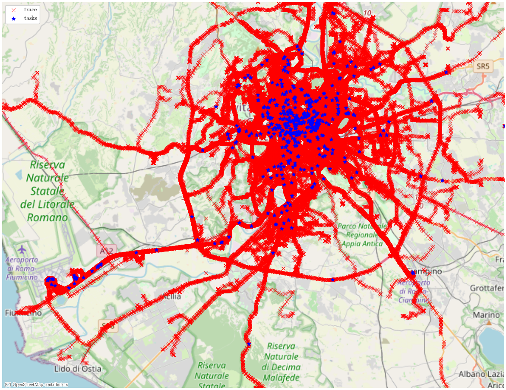
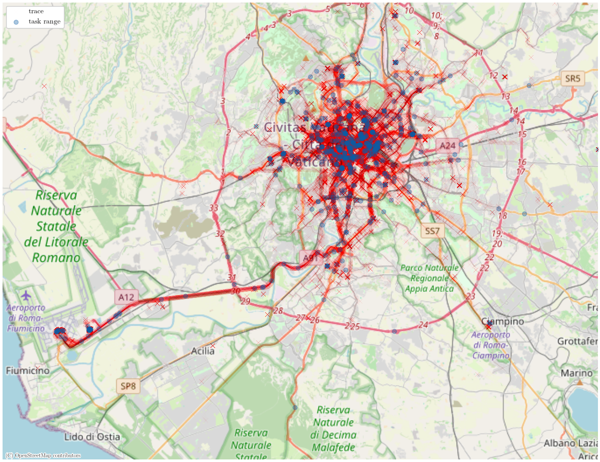
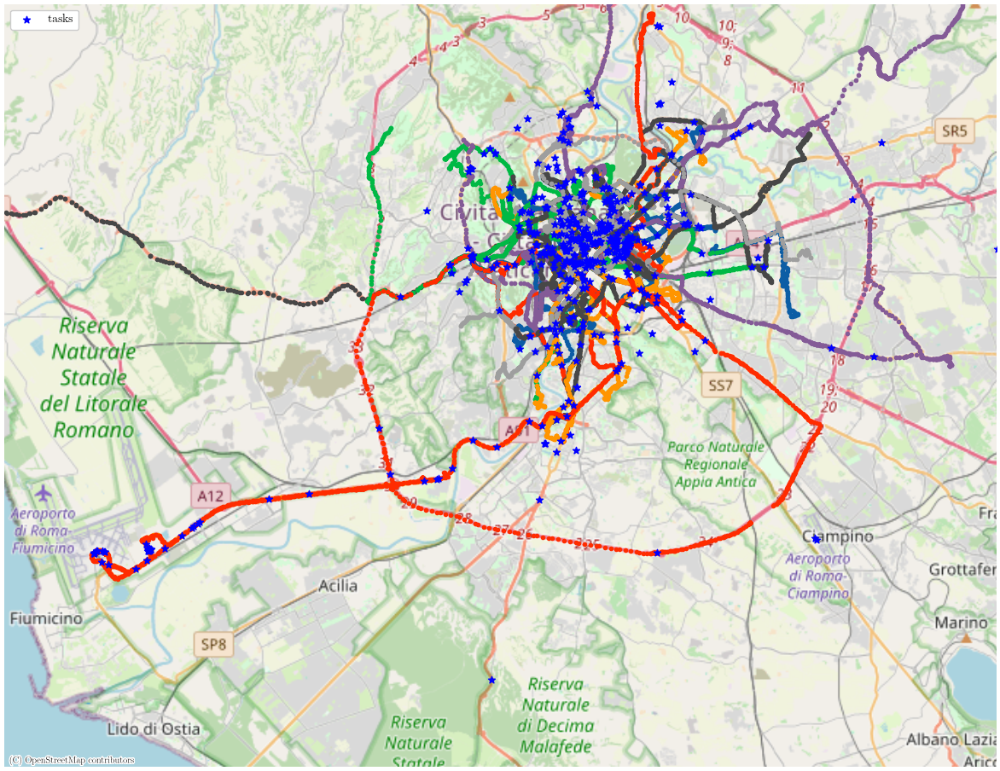

# Replica-EUWR: Combinatorial Multi-Armed Bandit Based Unknown Worker Recruitment in Heterogeneous Crowdsensing

> Developed and tested on Apple M1, macOS 13.5.2 (22G91).

## Overview

This repository contains the Python re-implementation of the Unknown Worker Recruitment (UWR) algorithm, which is
proposed in the referenced paper:

```
@INPROCEEDINGS{9155518,
  author={Gao, Guoju and Wu, Jie and Xiao, Mingjun and Chen, Guoliang},
  booktitle={IEEE INFOCOM 2020 - IEEE Conference on Computer Communications}, 
  title={Combinatorial Multi-Armed Bandit Based Unknown Worker Recruitment in Heterogeneous Crowdsensing}, 
  year={2020},
  volume={},
  number={},
  pages={179-188},
  doi={10.1109/INFOCOM41043.2020.9155518}
}
```

Our code strives to faithfully replicate the algorithms and experiments described in the paper, allowing for the
validation of the paper's assertions.

### Dependencies

Ensure Python 3.x is installed on your system. To install project dependencies, run:

    pip install -r requirements.txt

## Details

### Data Source

This repository utilizes data from [CRAWDAD RomaTaxi](https://ieee-dataport.org/open-access/crawdad-romataxi). For
similar results, download the dataset and place it in the `./dataset` directory.

### Simulation Data Generation

One significant obstacle in replicating the experiment is the insufficiently developed simulation description, particularly with regard to the processing of GPS data. Despite this, we
make our utmost effort to adhere to the description provided in the
paper [[code](./processor.ipynb), [code](./generator.py)].

The selected tasks are given by blue stars, while the trajectory of some of the chosen workers by colorful dots.

|Task|Buffer|Worker|
|--|--|--|
||||


The `generator.py` file also contains the `EasyGenerator` class for simulating data, which randomly generates workers
and tasks. Modify the generation mode in `config.py` to switch between different simulation settings.

### Algorithm Implementation

Due to limited descriptions of compared algorithms in the replicated paper, we implemented the `epsilon-first`, `alpha-optimal`, and `random` algorithms based on our understanding. The proposed algorithm from the paper has been faithfully reproduced according to the provided pseudocode. These implementations can be found in the `./algorithms` directory.

## Experimental Results

|UWR|EUWR|
|--|--|
|||

### Discussion

📊 **Total Weighted Quality**:
- 🟢 **UWR(EUWR) & Optimal**: Closely matched performance.
- 🔵 **0.1-first, 0.05-first, & Random**: Less stable compared to the paper.

🧠 **UWR**: Theoretically, the Optimal algorithm should strictly outperform all others. However, in our implementation, we drew inspiration from the concept of Steepest Ascent, which may lead to finding only a local optimum, even when all hidden parameters are known.

🔍 **Observation**: The instability in the relationship among 0.1-first, 0.05-first, and random algorithms, as compared to the original study, may be due to our different interpretation stemming from the paper's limited algorithmic descriptions.

📈 **Total Rounds**:

👓 **Note**: Our replicated algo.1 and algo.2 show a higher number of rounds than those in the original experiment. Additionally, the magnitude of our results differs from those reported in the paper, potentially attributable to our distinct understanding and implementation based on the non-detailed data processing methods in the study.


## Issues

For bugs, questions, or discussions, please use the issues section of this repository.

## Contributions

We welcome contributions to enhance the accuracy of replication. Fork the repository, commit your changes, and make a
pull request.
